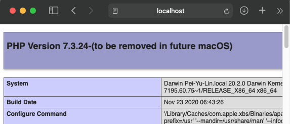

# Web server setting

**Enviroment**

Ubuntu: 16.04.2

Apache: 2.4

PHP: 7.3


**Install Apache2**

```bash
sudo apt install apache2
```

```bash
sudo ufw app info "Apache Full"
```


**Install PHP**

```bash
sudo apt purge libapache2-mod-php7.3 libapache2-mod-php
sudo apt install libapache2-mod-php7.3 libapache2-mod-php
```

```bash
sudo a2enmod php7.3
sudo /etc/init.d/apache2 restart
```

 

**Enviroment**

Mac OSX

Apache: 2.4

PHP: 7.3


**Apache2**

you don't need to install Apache on Mac.

```bash
sudo -s 
apachectl start
```

Check if Apache works by typing **http://localhost/** in your browser.


```bash
apachectl restart
```

**Install PHP**

```bash
vim /etc/apache2/httpd.conf
```

then remove the # berfore the following text and save.

```bash
LoadModule php7_module libexec/apache2/libphp5.so
```

```bash
apachectl restart
```

for checking idf php works, build a .php file for testing.

```bash
vim /Library/WebServer/Documents/phpinfo.php

<?php phpinfo(); ?>
```

Check it by typing **http://localhost/phpinfo.php** in your browser.



**Install Composer**

Download [Composer](https://getcomposer.org/) and following the instrcution by typing the following text in terminal.

```bash
php -r "copy('https://getcomposer.org/installer', 'composer-setup.php');"
php -r "if (hash_file('sha384', 'composer-setup.php') === '756890a4488ce9024fc62c56153228907f1545c228516cbf63f885e036d37e9a59d27d63f46af1d4d07ee0f76181c7d3') { echo 'Installer verified'; } else { echo 'Installer corrupt'; unlink('composer-setup.php'); } echo PHP_EOL;"
php composer-setup.php
php -r "unlink('composer-setup.php');"
```

Then 

```bash
 mv composer.phar /usr/local/bin/composer
```

**Install Laravel**

```
composer create-project laravel/laravel FOLDERNAME
```

